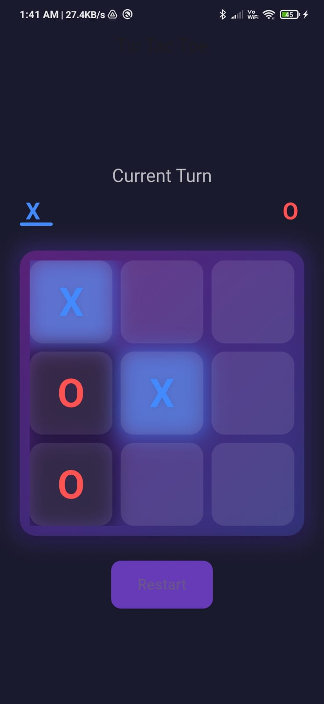
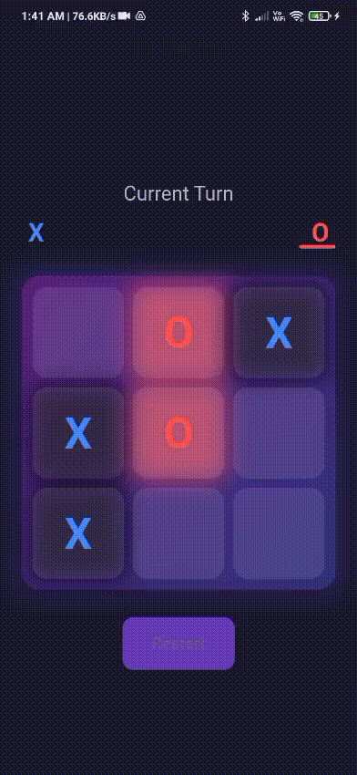
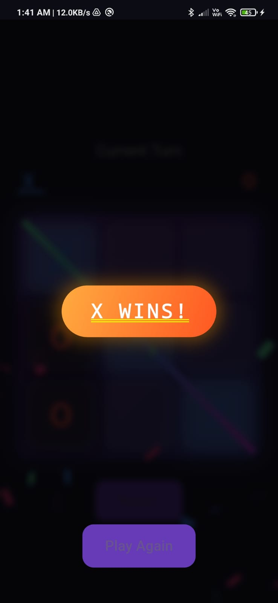

# 🎮 Tic-Tac-Toe Game (Flutter)

A beautifully crafted **Tic-Tac-Toe mobile app** built with **Flutter** for both Android & iOS.

This project demonstrates:
- Clean and modern UI/UX
- Smooth player turn indicator
- Win/Draw detection with dynamic victory strip animation
- Grid animations and winning line effects
- Production-level Flutter app structure

---

## 🚀 Features
- Two-player game on the **same device**
- Animated **3x3 Grid UI** with current turn highlight
- **Win or Draw detection** with stylish **Victory Strip Animation**
- **Restart button** to reset the game seamlessly
- Confetti effects & animated winning line overlay
- Fully responsive design for all screen sizes

---

## 📂 Folder Structure
```
lib/
├── main.dart
├── screens/
│   └── game_screen.dart
├── widgets/
│   ├── animated_tile_widget.dart
│   ├── result_dialog.dart
│   └── winning_line_painter.dart
    └── tile_widget.dart
assets/
└── animations/ (optional lottie files if used)
pubspec.yaml
README.md
```

---

## 📸 Screenshots

| Play Area | Win Animation | Winner Banner |
|---------------|---------------|-----------|
|   |  | |

---

## 🛠️ Tech Stack
- **Flutter** (Dart)
- **setState / Custom Animations**
- **Confetti Package**
- Custom UI Widgets & Painters

---

## 📥 Installation & Running
1. Clone the repo:
   ```bash
   git clone https://github.com/saurav1301/tic_tac_toe.git
   cd tic_tac_toe_app
   ```

2. Install dependencies:
   ```bash
   flutter pub get
   ```

3. Run the app:
   ```bash
   flutter run
   ```

---

## ⭐ Support
If you like this project, consider giving it a ⭐ on GitHub — it motivates me to build more! ✨

---
